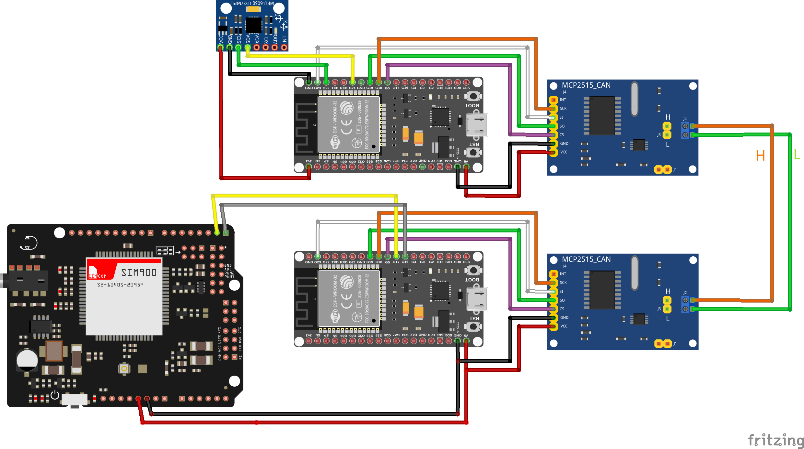

# Can2Cloud

### Clone the repository
```bash
git clone --recurse-submodules git@bitbucket.org:eldoradocorp/can2cloud.git
```

## Prerequisites
- [ESP-IDF v5.1](https://docs.espressif.com/projects/esp-idf/en/latest/esp32/get-started/index.html#installation-step-by-step)
- [VSCode](https://code.visualstudio.com/)

## Introduction
Application to send data from a CAN bus to a cloud service. One ESP32 is used to read the accelerometer data and send it to the CAN bus. The other ESP32 is used to read the data from the CAN bus and send it to the cloud service through module SIM900a that uses the GPRS network.

## Hardware
- 2 ESP32
- 2 CAN bus modules MCP2515
- 1 SIM900a
- 1 Accelerometer MPU6050

### Circuit diagram


The two ESP32 follow the same pinout with the MCP2515 module:

| **MCP2515** | **ESP32** | **Wire** |
|:-----------:|:---------:|:--------:|
|     VCC     |     5V    |    Red   |
|     GND     |    GND    |   Black  |
|      CS     |   GPIO5   |  Magenta |
|     MISO    |   GPIO19  |   Green  |
|     MOSI    |   GPIO23  |   White  |
|     SCK     |   GPIO18  |  Orange  |
|     INT     |    N.C    |  No wire |


The MPU6050 module is connected to one of the ESP32:
| **MPU6050** | **ESP32** | **Wire** |
|:-----------:|:---------:|:--------:|
|     VCC     |     3V3   |    Red   |
|     GND     |    GND    |   Black  |
|     SCL     |   GPIO22  |   Green  |
|     SDA     |   GPIO21  |   Yellow |

The SIM900a module is connected to the other ESP32:
| **SIM900a** | **ESP32** | **Wire** |
|:-----------:|:---------:|:--------:|
|     VCC     |     5V    |    Red   |
|     GND     |    GND    |   Black  |
|     TXD     |   GPIO17  |   Yellow |
|     RXD     |   GPIO16  |   Grey   |

## Software

The ESP32 is programmed using the ESP-IDF framework. Two codes are used, one for each ESP32. The code [main_receive.cpp](main/main_receive.cpp) is used to read the data from the CAN bus and send it to the cloud service. The code [main_send.cpp](main/main_send.cpp) is used to read the data from the accelerometer and send it to the CAN bus.

The code [main_receive.cpp](main/main_receive.cpp) uses the submodule [mcp2515](components/mcp2515/) to read the data from the CAN bus and the component [sim900a](components/sim900a/) to send the data to the cloud service. The code uses 2 tasks, one to read the data from the CAN bus and another to send the data to the cloud service. Queue is used to pass the data between the tasks and store the CAN messages.


The code [main_send.cpp](main/main_send.cpp) uses the submodule [mpu6050](components/mpu6050/) to read the data from the accelerometer and the component [mcp2515](components/mcp2515/) to send the data to the CAN bus. The code uses 2 tasks, one to read the data from the accelerometer and another to send the data to the CAN bus. Queue is used to pass the data between the tasks and store the accelerometer data.

## How to use
Modify the variable APP_VERSION in [CMakeLists.txt](main/CMakeLists.txt) for select the code to be compiled. The code [main_send.cpp](main/main_send.cpp) is compiled when APP_VERSION is equal to 1. The code [main_receive.cpp](main/main_receive.cpp) is compiled when APP_VERSION is equal to 2.

## Documentation
The documentation of the code is generated using Doxygen. The documentation is available in the folder [docs](docs/).

#### Contributors
Samuel Henrique Guimarães Alencar (samuel.alencar@eldorado.org.br)

Elias Frota Coutinho Filho (elias.filho@eldorado.org.br)